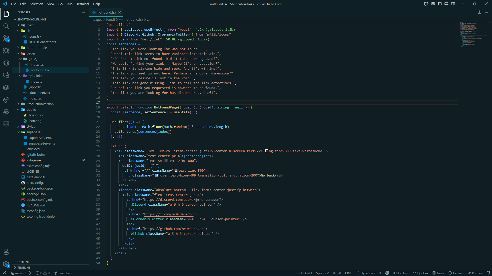
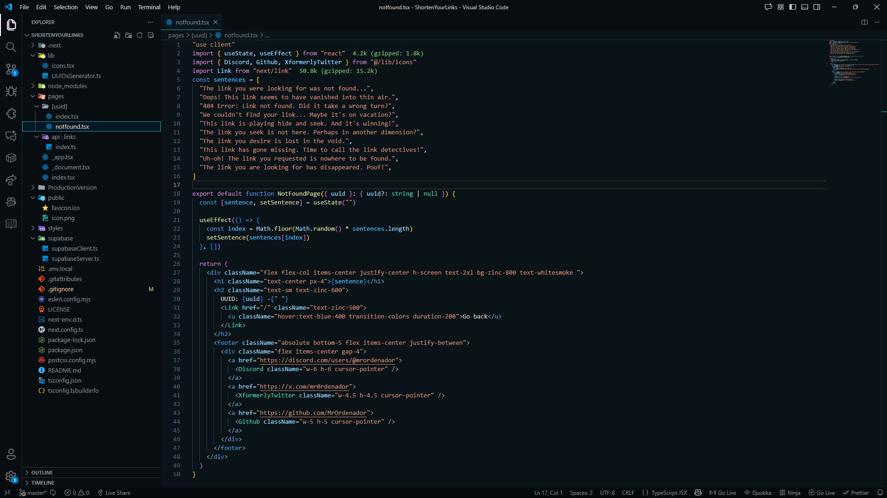
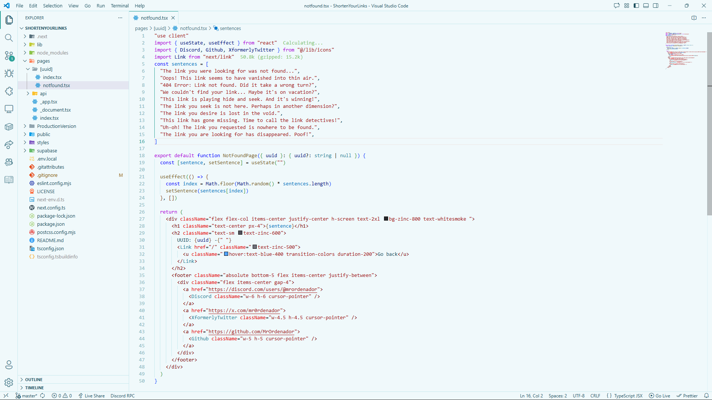

<h1>
  
  Dark Narwhal Theme
  
</h1>

<i>A dark blue theme for VSCode inspired by the deep ocean</i>

 

  
 
  

---

## Overview

Dark Narwhal Theme delivers a clean and modern dark blue color palette inspired by the depths of the ocean. Designed for clarity, comfort, and long coding sessions.
It uses the default VSCode color syntax, so you don't have to adapt to a new one.

### Dark Narwhal:

### Darker Narwhal:

### Light Narwhal:

<i>Not making a Lighter version anytime soon 🤦‍♂️</i>

---

## What's New?

See the latest changes in the project:  
[CHANGELOG](CHANGELOG.md)

---

## Contributing

Contributions are welcome. If you want to suggest improvements or submit a pull request, visit the repository: 

https://github.com/MrOrdenador/Dark-Narwhal-Theme

If you encounter an issue, please include:

- VS Code version  
- Theme version  
- Screenshots (if possible)

Issue tracker:  
https://github.com/MrOrdenador/Dark-Narwhal-Theme/issues

---

## License

This project is licensed under the MIT License.  
See the [LICENSE](LICENSE) file for details.
